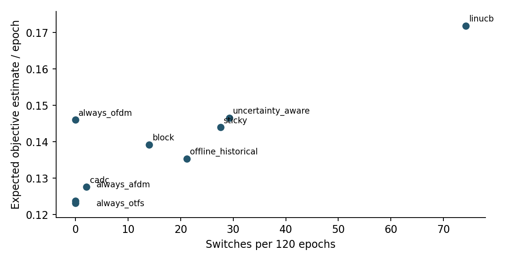
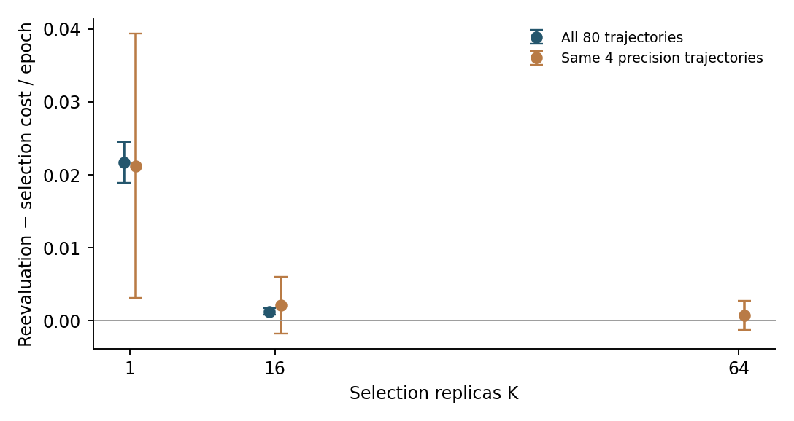
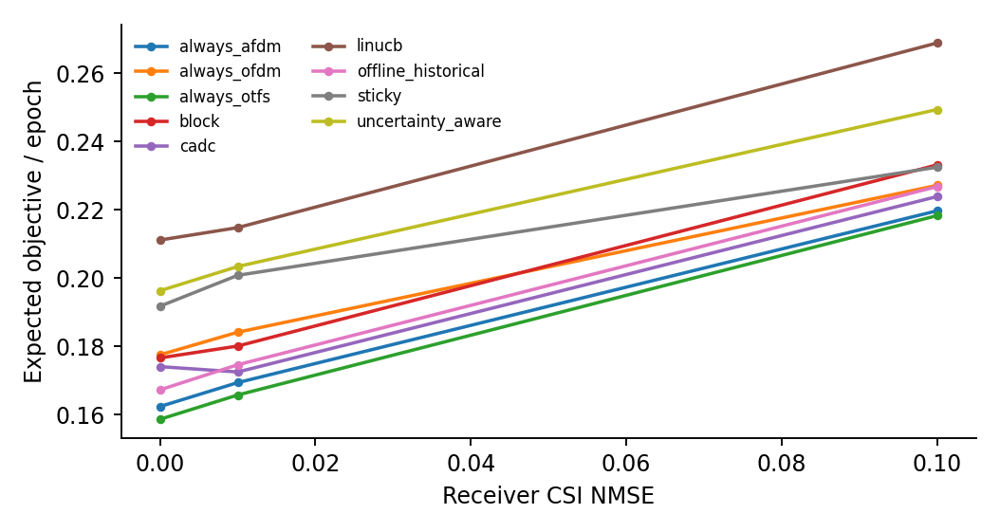

# Waveform adaptation and feedback reliability

## Model and experiment

Unitary OFDM, reduced-prefix OTFS and chirp-prefix AFDM are evaluated using the
same channel realization, data and noise in paired comparisons. A synthetic
time-varying channel produces slow mobility, acceleration, abrupt changes and
recovery. The selector sees only its allowed context and selected-action feedback.
Simulator-derived BER feedback is a controlled research assumption, not an
implemented pilot/decoder feedback protocol.

The first experiments use composite communication and switching objectives.
Independent reevaluation then separates noisy action selection from assessment:
the loss used to pick an oracle path is not reused as its independent expected
performance estimate. Multiple finite replicas reduce, but do not eliminate,
winner's-curse effects. Epochs and bits within a trajectory are not independent
experimental samples.

## Confirmation results

The reliability study freezes 80 independent trajectories: 20 in each of four
families, 120 epochs per trajectory. The empirical advantage/dwell controller
(CADC) improves mean objective relative to sticky LinUCB by **0.016380 per epoch**
but is **0.004398 worse than development-selected fixed OTFS**. It switches only
2.1 times per trajectory, including two compulsory exploration switches.
This supports avoiding needless switching, not universal dynamic adaptation.

The original probe left the controller at its last action. A subsequent targeted
experiment explicitly selects the empirically best probed action and resolves
ties without fixed-index preference. Eight development trajectories and all six
three-action probe orders give **identical CADC and Explore-Then-Commit results**
in that test. The more complicated gate did not establish an advantage there.

## Observation versus receiver CSI

Noisy/delayed decision context and mismatched physical receiver CSI are distinct.
The initial context experiment still gives the receiver perfect CSI. Later
controlled CSI mismatch separately changes the receive model. Neither experiment
implements over-the-air estimation, pilots, coding or a real channel trace.

The numerical record is in `data/tables/adaptation/`: trajectory summaries,
paired contrasts, loss decomposition, coverage, policy feedback, and context/CSI
extensions. Earlier waveform-policy ablations are consolidated under
`data/tables/waveform-selection/`. Frozen settings and the runnable CLI are in
`configs/research/`, `configs/research_v2/` and `scripts/research_v2.py`.
