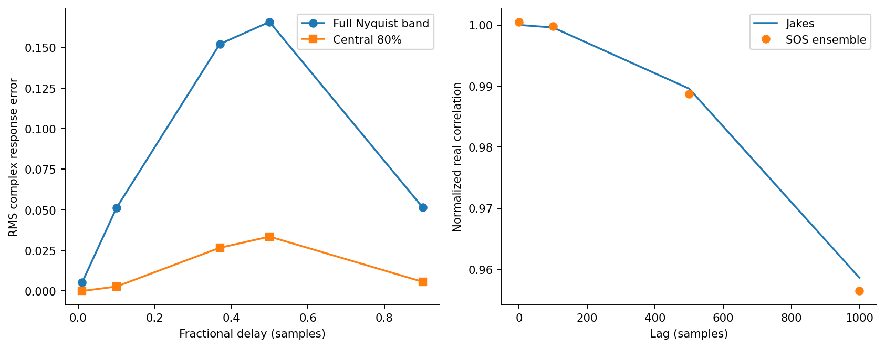

# Channel implementation and resource accounting

The profile values come from **3GPP TR 38.901 V19.5.0 (2026-09)**,
Tables 7.7.2-1, 7.7.2-3 and 7.7.2-5. The values were extracted from the
[official DOCX archive](https://www.3gpp.org/ftp/Specs/archive/38_series/38.901/38901-j50.zip);
the [ETSI PDF](https://www.etsi.org/deliver/etsi_tr/138900_138999/138901/19.05.00_60/tr_138901v190500p.pdf)
is an independent reading format. `configs/tdl_profiles.json` records the source
version, URL, access date and archive SHA-256. The standards documents themselves
are not included in the release.

## Scope

This is a **TR 38.901 profile-based SISO** channel, not a complete conformance
implementation. Spatial consistency, arrays, polarization and every normative
channel option are outside scope. Normalized delays are multiplied by 100 or
300 ns and then by 7.68 MHz, preserving fractional samples.

Tabulated dB powers are converted to linear powers and normalized together.
Individual realizations are not renormalized. The two zero-delay components of
TDL-E are the -0.03 dB LOS and -22.03 dB diffuse terms: their K-factor is 22 dB.
No additional Ricean component is added. LOS Doppler is `0.7 fd`.

Each diffuse path uses 32 complex-Gaussian sum-of-sinusoids coefficients and
uniform angular quadrature with a random angular offset. Marginals are proper
complex Gaussian; the finite angular sum approximates classical/Jakes correlation.
Phases continue across frames. The diagnostic ensemble has 7,200 path samples
with measured power 0.99872; these are not receiver inference units.

## Causal fractional delay

For physical delay `d=b+f`, `b=floor(d)` and `0<=f<1`, a 33-tap kernel is placed
at `b+j`, j=0...32, with coefficients proportional to
`sinc(j-16-f)*Kaiser(j,beta=8.6)`, normalized to unit squared energy.
The common causal latency is **16 samples** for all paths and waveforms and is
included in the guard. Exact integer fractions use a unit impulse at `b+16`;
integer-only half-width zero recovers the original integer-delay implementation.

CP/CPP is 128 samples for every waveform and covers all complete FIR supports in
the study. Payload is N complex symbols, total duration N+128 samples, alphabet
average symbol energy one, and complex noise variance `N0=10^(-SNR/10)`.
The useful sample fractions are 2/3 for N256 and 8/9 for N1024. Prefix phases
come from each actual waveform. No unused symbol, hidden suffix or waveform-only
resource discount is introduced.

Propagation applies the full time-varying FIR to the transmitted prefixed frame.
The receiver independently builds the matching sparse `C=RHP`. Tests compare
these two paths, including CPP phases, high Doppler and the integer limit.
No dense G/A is built online and no propagation path is discarded.

Finite FIR interpolation is not an ideal full-band all-pass delay. Unit energy
does not imply unit DC gain. At delay 0.5, RMS complex response error is 0.16577
over the full band and 0.03352 over its central 80%; the maximum full-band error
is about 1.00277. This is measured and retained, not hidden by unused subcarriers.

## Valid spectrum and costs

Fractional FIR/SOS paths are not constant-gain unitary shifts. The shared adapter
therefore uses valid bounds `alpha=N0` and
`beta=N0+||C||_1 ||C||_infinity`, rather than the older integer-path bound.
All methods receive the same sparse operator, Jacobi diagonal and spectrum inputs.

The work model counts real-equivalent operations, not machine cycles. With P
physical components, S=32 sinusoids, Q total nonzero FIR coefficients and h=16,
channel preparation is charged as

`40*N*P*S + N*Q*(20+2*log2(N*Q)) + 64*P*(2*h+1)`.

Another `32*nnz+20*N` covers adjoint, Jacobi/norm preparation. A PCG step costs
`16*nnz+40*N+8`. The ledger separately includes transforms, full residuals,
Gray/DP work, gate/refiner setup and final output. COO contributions are charged
before duplicate accumulation; immutable tables are not treated as free in work.
Every receiver call actually reconstructs its SOS/COO/CSR operator.

Raw CPU/wall timings cover receiver construction and solve. The reusable FIR
table is timed independently and amortized over **two actual frames**, never over
candidate methods or the three counterfactual waveform evaluations. Tables report
both raw and corrected timings; the corrected value combines measured call time
with measured common setup amortization, not a single timer reading. Memory
diagnostics use tracemalloc separately from timing, including construction
temporaries. Reference solves and transmitted truth are evaluator-only costs.
