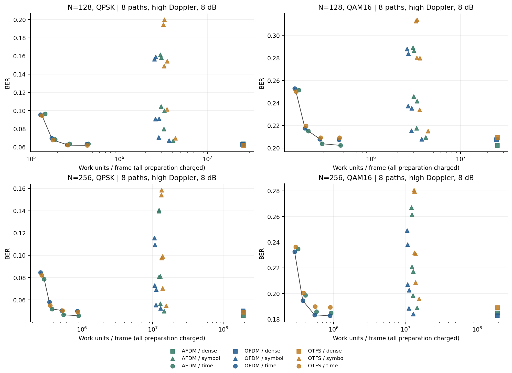
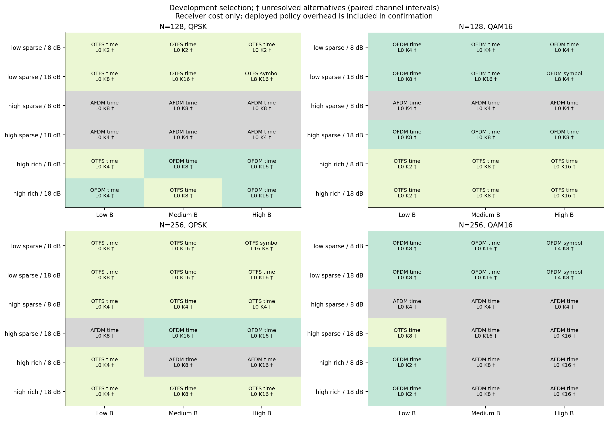

# Compute-budgeted waveform and receiver adaptation

## Fair comparison

For each waveform's symbol-domain channel G, retain each row's L largest
magnitudes, then solve the regularized least-squares approximation with Jacobi
PCG for at most K iterations. Equal retained counts and iteration counts are
not assumed to mean equal total work. The paired received signal always traverses
the **complete channel**. Discarded coefficients are not relabeled as independent
white noise.

The stronger baseline constructs the exact sparse time-domain operator directly
from physical paths and transforms its solution back to waveform coordinates.
Dense LMMSE is a reference. Preparation, row selection, preconditioning,
transforms, policy calculations and iterations all enter the budget.
The small action set includes six (L,K) combinations and four time-domain K
values per waveform; it avoids a large Cartesian sweep.

## Evidence and results

The development grid contains 72 channel/resource states, followed by 60 new
paired trajectories. Iteration budgets produce real BER-cost choices. However,
the tested lightweight joint selector has BER **0.101009**, versus **0.097997**
for the validation-selected fixed configuration, at **2.49 times** the modeled
work. The paired BER difference is +0.003011, with a stratified trajectory
bootstrap interval [+0.001760,+0.004306]. The experiment did not confirm a useful
waveform-switching benefit beyond adapting receiver computation.

The symbol-domain sparse structure depends on representation. Preparing a dense
effective channel and then truncating it can cost more than directly solving in
the common time domain. This coordinate/preparation effect must not be presented
as a fundamental waveform superiority result. Dense unitary equivalence also
does not by itself imply identical finite-alphabet hard-decision BER.

`data/tables/receiver-budget/` retains the grid, Pareto envelope, trajectory
outcomes, convergence/truncation and memory/CPU decomposition. The existing
`method-development.zip` retains the compact raw budget-study record.
Run `scripts/research_v3.py --help` for the phased experiment interface.
