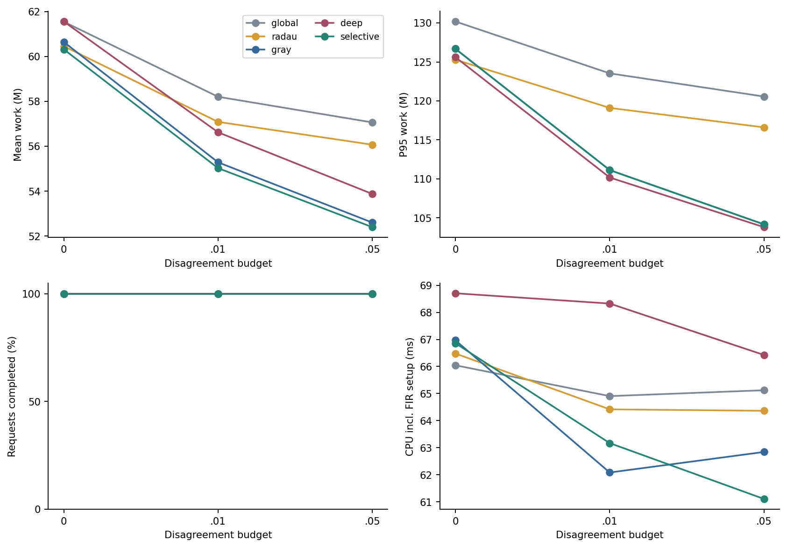
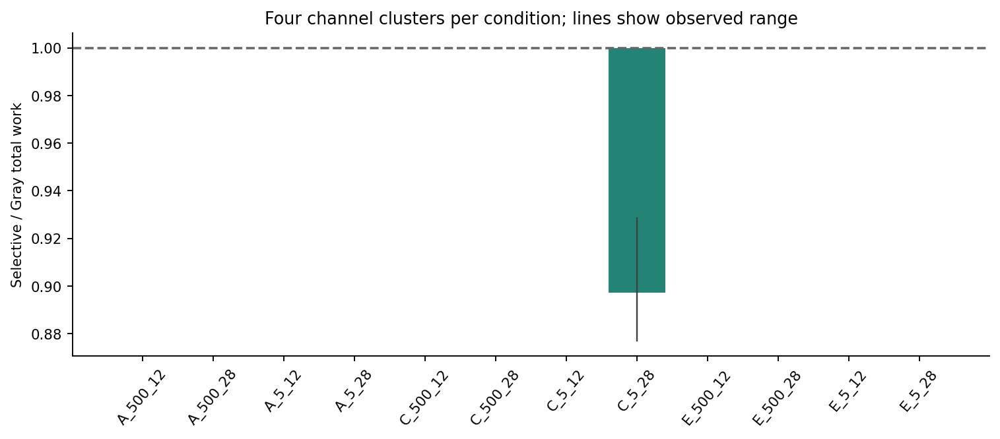
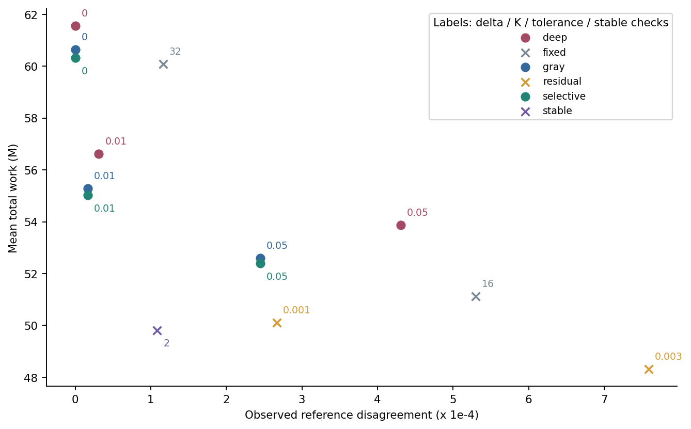
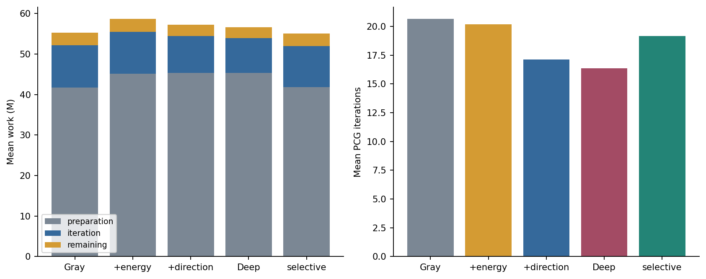

# Experimental record

## Question and design

Can posterior information about final Gray decisions reduce receiver computation
relative to fixed iterations, tuned residual stopping and hard-decision stability?
The study separates a mathematical disagreement guarantee from empirically
matched decision quality, and counts preparation as well as solver iterations.

The final protocol contains 12 conditions: TDL-A/C/E profile tables, 5/500 Hz
Doppler and 12/28 dB SNR, with N=256/1024 and QPSK/16-QAM interleaved rather than
crossed exhaustively. Three unitary waveforms share each channel, payload and
noise realization. Each confirmation channel has two successive frames.
There are **48 independent channel clusters and 288 received frames**.

Development uses seeds starting at 900000; validation at 910000; confirmation at
920000. The gate, targets, baseline thresholds, data-generation configuration and
confirmation seeds were frozen before the single confirmation run. No test-set
retuning or failure removal occurred. Statistical inference uses channel clusters,
pooling correlated frames/waveforms, with 5,000 paired bootstrap resamples.
The fixed 12-condition design does not represent every wireless environment.

## How the method was selected

Earlier compute-budget experiments found useful BER/work tradeoffs from receiver
iteration budgets, but symbol-domain dense construction and waveform selection
overhead erased apparent gains. A joint selector had BER 0.101009 versus 0.097997
for a validation-selected fixed configuration, at 2.49 times modeled work.
The research therefore moved to a common complete time-domain operator.

Direction-aware Krylov and target auxiliary solves were considered before shared
Gray energy checks; their extra transforms/solves did not justify their cost.
Subsequent structured-bound development distinguished three sources of looseness:
the error enclosure, the combinatorial Gray relaxation, and the cost of checking.
On 60 cached development frames, full DP saved no iterations and added 61.8% cost.
Exact small Gray-region enumeration also showed cases where the old dual bound
gave six possible changes versus the exact five. The response was cheap screening
and targeted refinement, rather than unbounded DP on every check.

An earlier independent synthetic study of the structured method used 576 received
frames. At delta=.01 it reduced modeled work from 11.250M to 10.485M and increased
completion from 93.06% to 98.61%, but P95 increased from 38.608M to 39.560M.
These are separate cohorts with different channels/costs, **not pooled with the
final profile-based study**. Supporting raw development evidence and original
source snapshots are in `method-development.zip`. Internal identifiers are retained
for provenance, not presented as competing software versions.

## Same-guarantee confirmation

| Delta | Method | Mean work, M | P95 work, M | Completion |
|---|---|---:|---:|---:|
| 0 | Gray | 60.646 | 126.681 | 100% |
| 0 | Radau | 60.456 | 125.288 | 100% |
| 0 | Selective | 60.318 | 126.681 | 100% |
| .01 | Gray | 55.286 | 111.125 | 100% |
| .01 | Radau | 57.086 | 119.103 | 100% |
| .01 | Selective | 55.026 | 111.125 | 100% |
| .05 | Gray | 52.601 | 104.161 | 100% |
| .05 | Radau | 56.070 | 116.602 | 100% |
| .05 | Selective | 52.398 | 104.161 | 100% |

At the primary delta=.01, Selective/Gray mean cost is **0.99531**, with paired
95% cluster bootstrap interval **[0.98943,0.99922]**. Against Radau it is
**0.96391 [0.95402,0.97304]**. Selective's P50/P90/P95/P99 work is
45.463/105.456/111.125/131.319M. Against Gray the P95/P99 increase by the 80-unit
gate fee; tail improvement should not be claimed.

CPU including separately measured two-frame FIR-table preparation amortization
is **63.169 ms for Selective versus 62.084 ms for Gray**. Raw receiver-call P95 CPU
is 250.000 versus 234.375 ms. Check wall time is 5.42% of Selective receiver time.
Windows process-time quantization and workstation timing limit interpretation of
small differences. Work ratios are not measured hardware speedups.

Strict-mode Selective/Radau cost is **0.99772 [0.99028,1.00288]**. No standard-profile
frame failed strict completion, so this cohort supplies no completion-rate
improvement evidence. Difficult-case improvements from earlier synthetic data
must not be generalized to these conditions.

## Where the gain occurs

The gate enables refinement on **8.33%** of received frames. All net savings occur
in TDL-C, 5 Hz, 28 dB, N256, QPSK, DS300 ns: mean Selective/Gray work is **0.89732**.
Its four cluster ratios range from 0.87690 to 0.92843. Other conditions fall back
to Gray plus the gate fee. With only four clusters in that subgroup, no separate
significance or broad applicability claim is made.

## Empirical quality matching

Development fixes `(mean disagreement target, P90 trajectory target)` at
`(.0005,.002)` and `(.002,.008)`. Validation selects the least expensive qualifying
candidate in each family: fixed K in 8/16/32/64/128/256, residual tolerance in
.01/.003/.001/.0003/.0001/.00001, stability checks in 2/4/8/12, and Selective delta
in 0/.01/.05. The selected methods are actually run on the new confirmation data.

Before confirmation, practical equivalence additionally requires the paired 95%
interval of mean disagreement difference to lie inside `[-q/2,q/2]`, and the P90
difference not to exceed `q_tail/2`. This is a stated finite tolerance, not proof
of equal error distributions. Unmatched methods receive no same-quality speedup.

| Target / method | Observed mean | Trajectory P90 | Mean work, M | Equivalence |
|---|---:|---:|---:|---|
| Tight / Selective .05 | .000245 | .001058 | 52.398 | Reference |
| Tight / residual .001 | .000267 | .000745 | 50.105 | Pass |
| Tight / fixed 32 | .000116 | .000053 | 60.078 | Not established |
| Tight / stability 2 | .000109 | .000244 | 49.813 | Not established |
| Loose / residual .003 | .000759 | .001994 | 48.320 | Pass |
| Loose / fixed 16 | .000530 | .001485 | 51.121 | Pass |
| Loose / stability 2 | .000109 | .000244 | 49.813 | Pass |

The same Selective .05 configuration is validation-selected for both targets.
Tight residual/Selective cost is **0.95625 [0.94349,0.96883]**: Selective costs
4.58% more. Loose residual/Selective is **0.92219 [0.90469,0.93790]**; loose
stability/Selective is **0.95067 [0.92690,0.97373]**. These heuristics have no
equivalent mathematical certificate, but that does not erase their cost advantage.

For tight fixed/stability, both quality ceilings transfer but the equivalence
interval does not: **quality matching did not transfer** under the frozen rule.
All heuristics terminate normally; certificate completion is not applicable,
rather than a zero solver-success rate.

## Ablation and preparation costs

| Bound/check path | Mean work, M | Mean PCG iterations | P95 work, M |
|---|---:|---:|---:|
| Gray | 55.286 | 20.635 | 111.125 |
| + spectral energy | 58.645 | 20.167 | 115.625 |
| + directions | 57.209 | 17.132 | 111.480 |
| Full refinement | 56.622 | 16.368 | 110.170 |
| Selective refinement | 55.026 | 19.153 | 111.125 |

The energy ablation changes individual radii; the baseline joint-ball check stays
unchanged. Full refinement additionally changes the joint weighted-region path,
so its effect is not a pure DP-only ablation. Full refinement has 57 successful
target checks; Selective has one. All ablations have 100% completion.

Preparation costs 41.756M for Gray and 45.301M for full refinement; preparation
already represents 75.5% of Gray's total work. Full refinement removes 20.7% of
iterations yet adds 2.42% total work. Its slight P95 improvement does not reverse
the mean-cost regression.

## Numerical evidence and limitations

At delta=.01 Selective's observed reference disagreement is **0.00001695**, true
BER **0.024732**, and individual-bit coverage **68.65%**. Shared energy bounds the
aggregate disagreement even when individual unknown bits remain; unknown does
not mean incorrect. Across 4,896 certificate-method records, observed bound
violations, unmet requests, reference ambiguity and local refinement numerical
unknown counts are all zero. None establishes end-to-end floating-point validity.

Six new tiny systems agree after converting independent 80/110-digit Decimal
solutions back to double precision. An additional N1024/64-QAM/1800-Hz stress
frame meets its request with zero observed reference disagreement. Boundary,
cancellation, recurrence-drift, invalid-spectrum and exact Gray-enumeration tests
are retained. Peak traced allocation in the N1024 memory diagnostic is 52.08 MiB,
versus a maximum main-cohort resident-array estimate of about 3.29 MiB. Neither is
an operating-system RSS measurement.

The channel's full-band fractional-delay approximation is a substantive
limitation: at half-sample delay its response RMS error is **16.58%** over the full
Nyquist band, versus 3.35% in the central 80%. The experiment uses the full band;
central-band accuracy cannot substitute for it. This may affect conditioning and
the apparent benefit of spectral refinement. [Channel details](channels.md).

## Conclusion

The frozen evidence supports a small conditional reduction in modeled work, not a
universally faster receiver. The strongest empirical-quality baselines remain
cheaper; full refinement regresses in mean cost; the favorable subgroup is small;
physical approximation and the closest prior-art comparisons remain incomplete.
The internal paper-readiness assessment is **NOT_READY_FOR_PAPER**. Publishing
this software and its evidence does not change that scientific conclusion.

The full record contains 10,024 receiver evaluations including development and
diagnostics, not 10,024 independent observations. New experiment scripts consumed
approximately 1,063 seconds, excluding development time. Compact tables are in
`data/tables`; raw inputs, outputs, original protocols and code snapshots are in
the checksummed evidence archives. No old experiments were rerun for this release.
