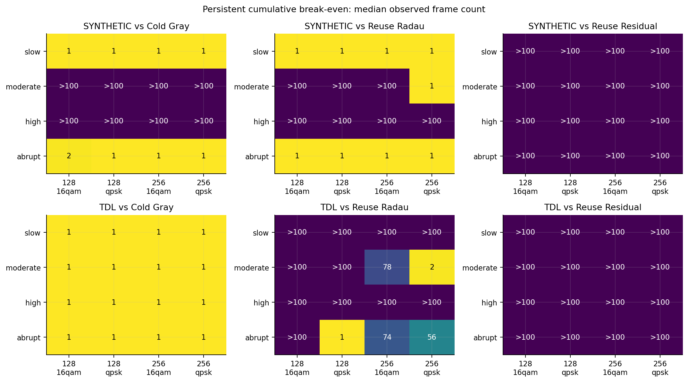
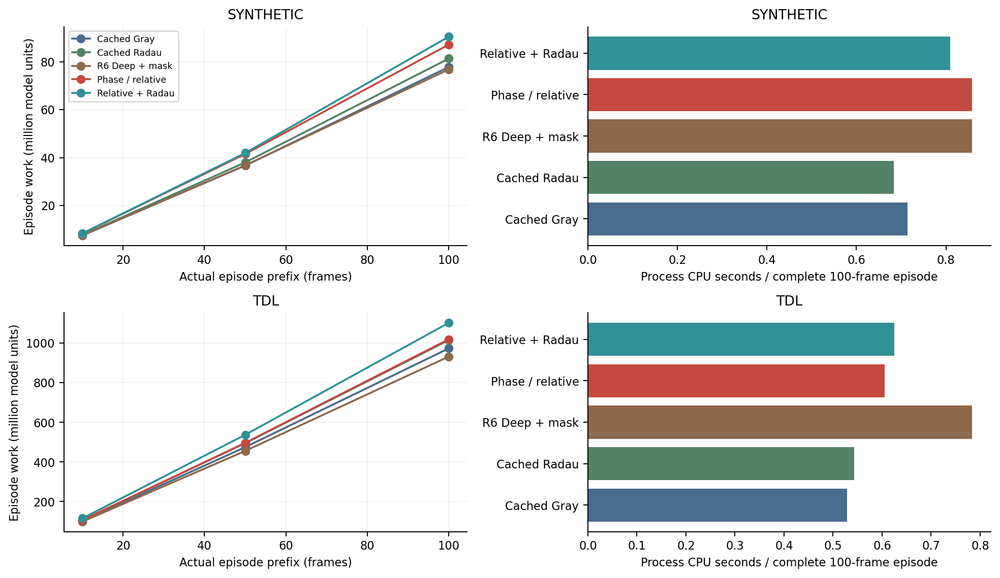
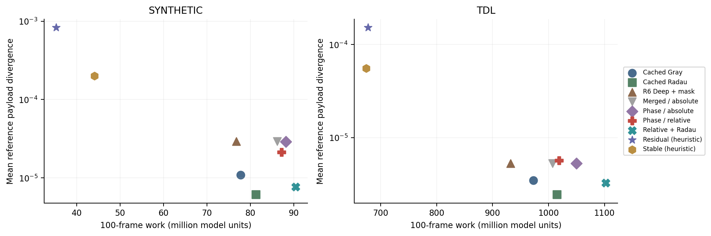

# Preparation reuse and actual operator changes

## What is reusable

Static constellation geometry, waveform/index information, fractional-delay
kernels, sparse support maps and relative sinusoid phase tables can be reused
under their checked keys. Current channel gains, complete C/C-adjoint, RHS,
residuals, solver state and decision information remain current-frame work.
Prior payload solutions are not automatically good initial guesses for new data.
No old RHS or Krylov recurrence is carried between independent payloads.

The preparation study separates cold construction, the same optimized construction
reset every frame, and cross-frame reuse. This avoids attributing vectorized
assembly gains entirely to caching. A valid but weak update can rebuild; an invalid
proposal falls back. Initial preparation and all validation work are charged.

## Paired preparation study

In the primary comparison, reuse-aware structured refinement has modeled episode
work ratios **0.4815** [0.4727,0.4896] against the older cold Gray path,
**0.7673** [0.7591,0.7752] against the optimized frame-reset structured path,
and **0.9954** [0.9763,1.0160] against legally cached Radau.
The corresponding ratio to the tuned cached residual solver is **2.1493**;
empirical quality equivalence was not established, so this is not a same-quality
speed comparison. Ratios are modeled work, not measured CPU speedups.

## Correcting the change metric and payload scope

Path identities and sparse coordinates are validated explicitly. Canonicalization
must merge duplicate coefficients before measuring actual operator changes;
path-wise bounds can miss cancellations or greatly overestimate change.
Two noncanonical-input defects were fixed and retained as regression tests.

The next frozen comparison uses **64 independent channel episodes**, each with
100 frames and three correlated waveforms. Nine methods share current CSI/noise,
payload, data, fresh within-solve Jacobi and delta=.01. Whole-episode timings use
randomized method order and two state-reset repetitions. The three waveforms and
repeated timings are not independent channel samples. Only two seeds occur in
each balanced condition cell; subgroup conclusions remain descriptive.

Selected payload bits are certified in their actual return order. A full-N
white-prior LMMSE reference remains fixed even with known zero coordinates;
it is not the reduced-prior estimator that uses those zeros as prior information.
Methods are not given different references to manufacture a gain.

For profile-based TDL, phase-relative refinement takes **22.70% less CPU** than
the masked older structured path but **9.35% more modeled work**. Compared with
cached Radau it takes **11.48% more CPU**, with work ratio 1.0041
[0.9842,1.0261]. Actual coefficient merging captures much of the runtime change.
Synthetic confirmation likewise does not show an overall benefit. More accepted
updates or fewer PCG steps do not establish a superior complete receiver.

The relevant implementation is `reuse_paths.py`, `reuse_geometry.py`,
`certiphy_reuse.py`, `operator_reuse.py` and `payload_selection.py`. Tests include
zero rows, cancelling paths, noise changes, index reordering and anchor drift.
`floating_point_certified` stays False: numerical diagnostics do not enclose the
entire floating-point operator/FFT/solver chain.

Tables: `data/tables/reuse-preparation/` and `data/tables/reuse-operator/`.
All recorded confirmation outcomes and explicitly labeled four-frame received
fixtures are in `data/reuse-evidence.zip`. The runners are
`scripts/research_v6.py` and `scripts/research_v7.py`; frozen parameters retain
their original identifiers to trace the evidence, not to create separate public
project editions.
